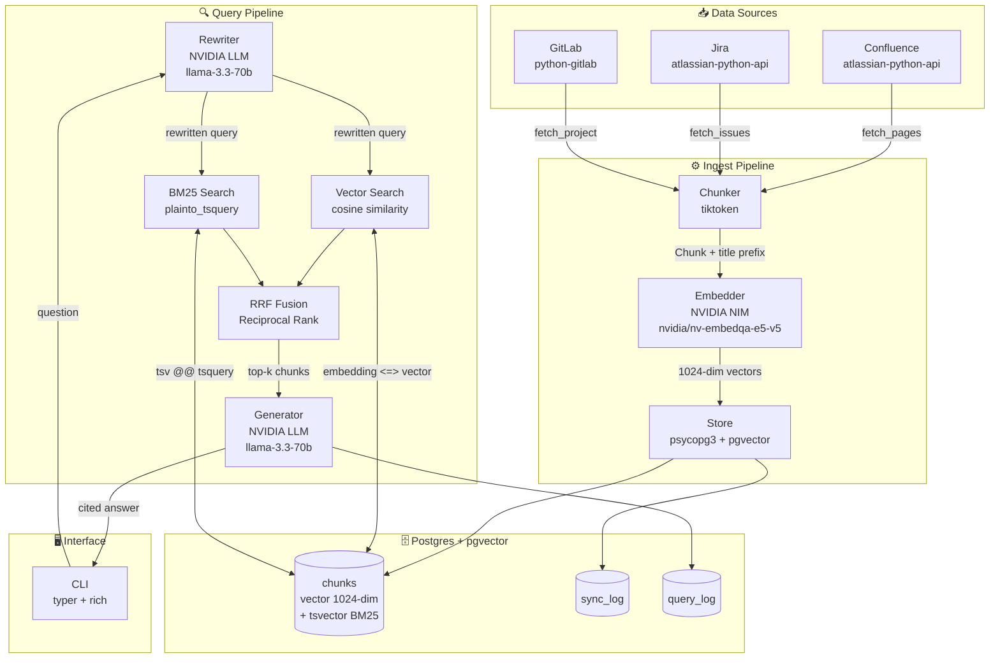

# RAG System Architecture

## Full Stack Overview



---

## Library Choices (no LangChain, no LlamaIndex)

| Layer | Library | Why |
|---|---|---|
| Embeddings | NVIDIA NIM `nvidia/nv-embedqa-e5-v5` | Free, 1024-dim, hosted |
| Generation | NVIDIA NIM `meta/llama-3.3-70b-instruct` | Free, same API key |
| Vector DB | `pgvector` on Postgres | No extra infra, HNSW index |
| BM25 | Postgres `tsvector` | Built into Postgres, no Elasticsearch |
| Hybrid ranking | Reciprocal Rank Fusion (hand-written) | Simple, no black box |
| Confluence/Jira | `atlassian-python-api` | Official client |
| GitLab | `python-gitlab` | Official client |
| Chunking | `tiktoken` | Token-accurate, fast |
| Config | `pydantic-settings` | Type-safe env loading |
| CLI | `typer` + `rich` | Clean output, zero boilerplate |

---

## Query Flow (step by step)

```
User question
    │
    ▼
[Rewriter] — llama-3.3-70b rewrites for better recall
    │
    ├──▶ [NVIDIA Embedder] → 1024-dim vector
    │         │
    │         ▼
    │    [Vector Search] — cosine distance on pgvector HNSW index
    │
    └──▶ [BM25 Search] — Postgres tsvector full-text match
              │
              ▼
         [RRF Fusion] — combines both ranked lists (k=60)
              │
              ▼ top-5 chunks (with curated boost applied)
         [Generator] — llama-3.3-70b answers with [N] citations
              │
              ▼
         Answer + Sources + query_log entry
```

---

## Ingest Flow (step by step)

```
Source (Confluence / Jira / GitLab)
    │
    ▼
[Fetcher] — paginates API, strips HTML/ADF/Markdown to plain text
    │
    ▼
[Chunker] — tiktoken cl100k_base, 1000 tokens, 200 overlap
            title prepended to each chunk for better recall
    │
    ▼
[Embedder] — NVIDIA NIM, batches of 50, input_type="passage"
    │
    ▼
[Store] — upsert into Postgres (ON CONFLICT → update)
          tsvector trigger fires automatically
    │
    ▼
[sync_log] — records last_synced_at for incremental next run
```

---

## What was deliberately NOT used

| Skipped | Reason |
|---|---|
| LangChain | Hides the pipeline; hard to debug and tune |
| LlamaIndex | Same — abstraction over things we want explicit control of |
| Elasticsearch | Postgres tsvector is enough for BM25 at this scale |
| Cohere Reranker | Planned for Phase 2 eval — only add if eval score improves |
| Redis cache | Not needed until scale demands it |
| Celery / queues | Single-process ingest is fast enough |
